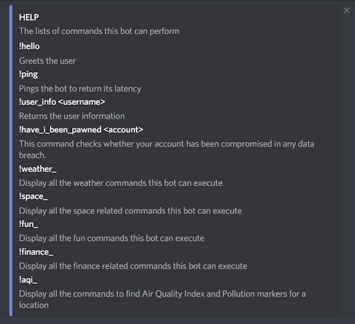
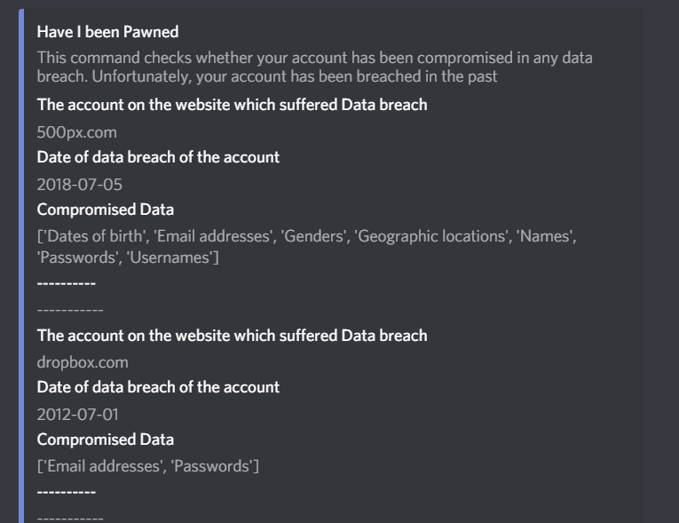
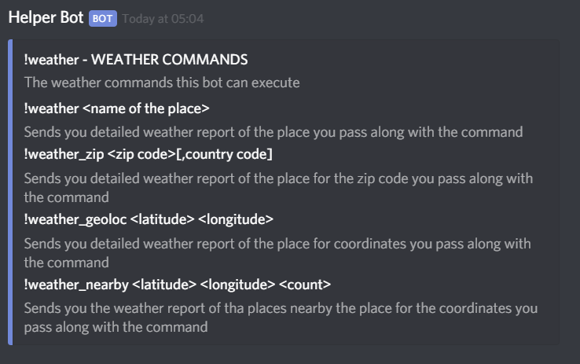
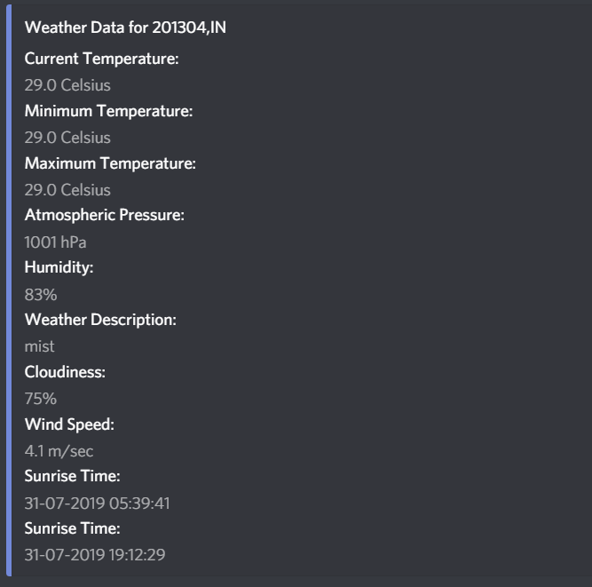
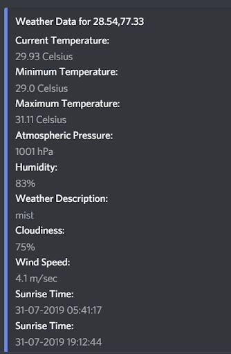
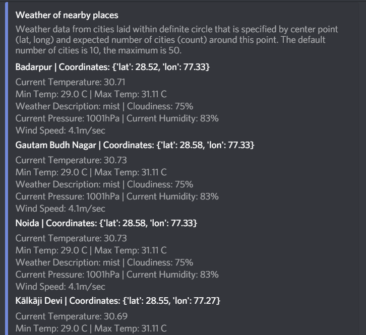
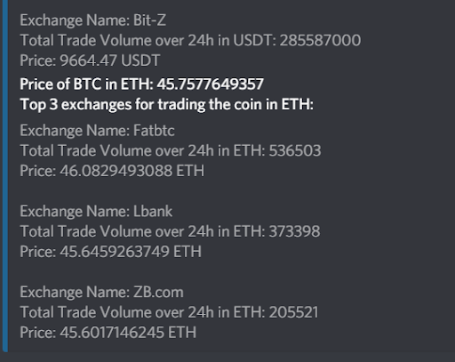
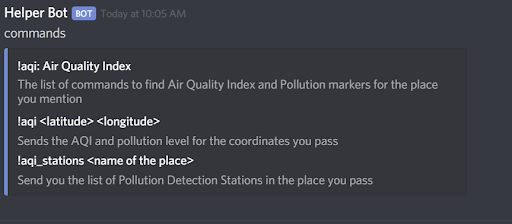
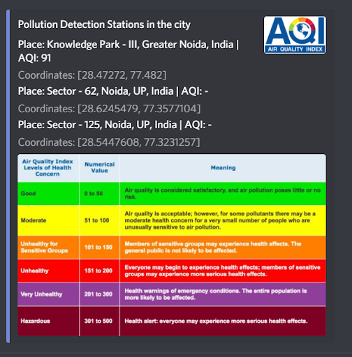

# Discord-Bot

A general purpose bot that uses discord.py library to give the following information to the user. 

It provides:

- Real time weather
- AQI of a place
- AQI stations around the place
- Crypto currency stats
- Forex exchange rates
- Currency Converter
- Details about next SpaceX launch
- upcoming ISS passes for a particular location
- Random Facts, Memes, Quotes
- Shareable Newsletter

It can set news sources for a user’s newsletter and send the user its newsletter along with a sharable link.

--- 

APIs used in this project are; 

- AQI api (https://aqicn.org/api/), 
- ISS location api (http://api.open-notify.org/),
- Open weather api(https://openweathermap.org/api),
- Coinlib api (https://coinlib.io/apidocs),
- Foreign currency exchange rates api (https://ratesapi.io/),
- Have I been pwned api (https://haveibeenpwned.com/API/v2) 

---

It starts with a `!help` command which displays all the categories of commands this bot can execute. The commands with an underscore after them are separate categories. 

---

### 1. Have I been Pawned (`!have_i_been_pawned`)

This command checks for data breach of your account at any time in the past. You have to provide your account id as an argument to the command. The following is the result of a command and a data breach was found for the mentioned account, and in case the account hasn’t been breached. It shows that your account is safe. 

*output of the command*

### 2. Weather (`!weather_`)

This category of commands give weather information for different arguments passed to the command. “!weather_” lists down all the commands in this category. Each command has arguments listed after it. Arguments within angle brackets are necessary to provide while arguments within square brackets have to provided without space.

*output of `!weather`*

#### 2.1. `!weather_zip`

Provided a zip code for a location with its country code, the bot gives the detailed current weather report for the location.

#### 2.2. `!weather_geoloc`
Provided the coordinates for a location, the bot gives the detailed current weather report for the location.

*output of the command*

#### 2.3. `!weather_nearby`

Provided the number of nearby places through count variable and coordinates for a location, the bot gives the current weather report of that many number of places near the location provided. 

*output of the command*

### 3. `!finance_`

This category contains three commands, forex - which gives the exchange rates of various currencies, convert - a currency converter and Cryptocoin - gives info about various crypto currencies. 

*output of the `!finance_`*

#### 3.1. `!forex`

A single base currency code is necessary argument for the command. When a target currency(s) is provided, it shows the exchange rates for those currencies.  

Here, the bot provided latest exchange rates for US Dollars in Indian rupees, Euro, and Singaporean Dollars. 

*output of the forex command*

#### 3.2. `!convert`

An amount, a base currency and a single target currency are necessary arguments. Multiple currencies can be provided to currency converter. 

*output of the convert command*

#### 3.3. `!coin_info`
The coin code and target currency are necessary arguments. The bot provides detailed information about the code in the target currency.

*output of the coin_info command*

#### 3.4. `!coin_exchanges`

Provides the top 3 markets and their exchanges for the coin and target currency pair provided.

*output of the coin_exchanges command*

### 4. AQI (Air Quality Index) `!aqi_`

Provided the coordinates of a location, the bot gives the AQI of the location, along with various pollutants and their concentration.

The following category contains two commands to AQI of a location. 

*AQI commands*

#### 4.1. `!aqi_stations` 

Given a city, it gives pollution detection stations near you

*AQI command output* 

